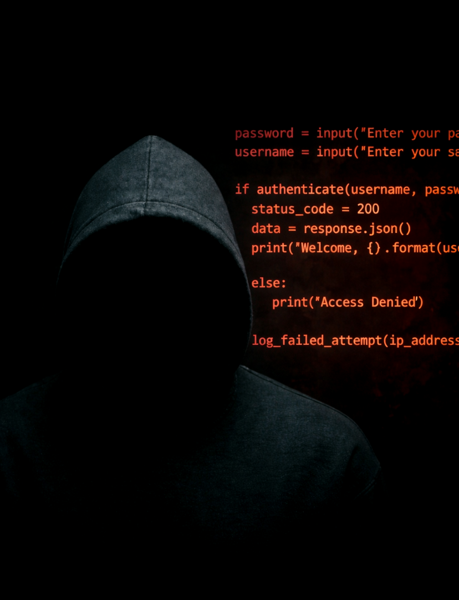
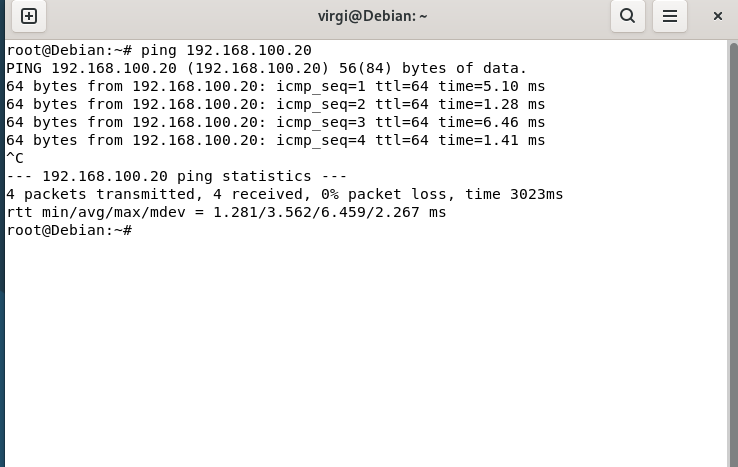
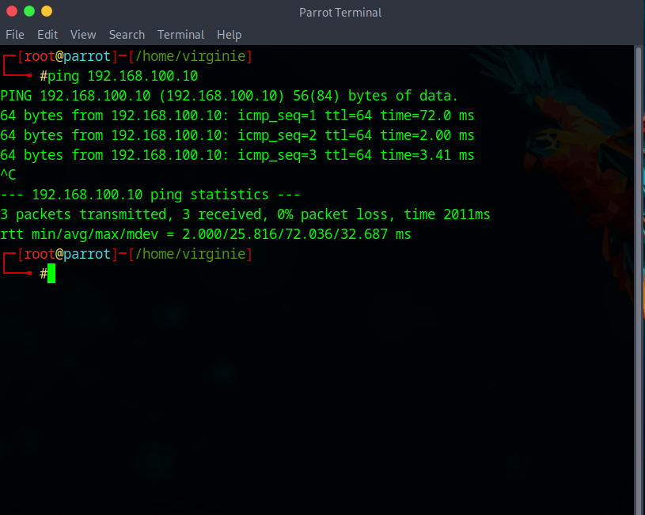
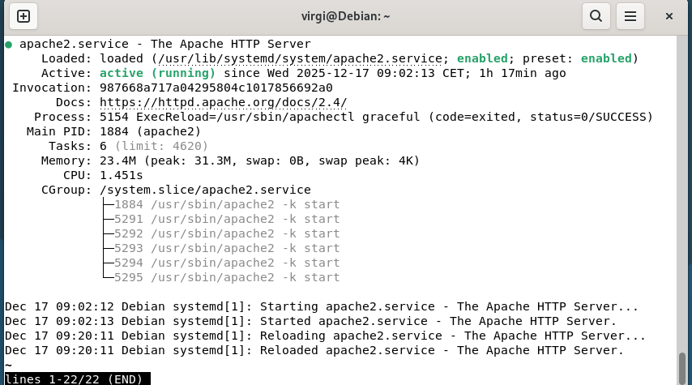
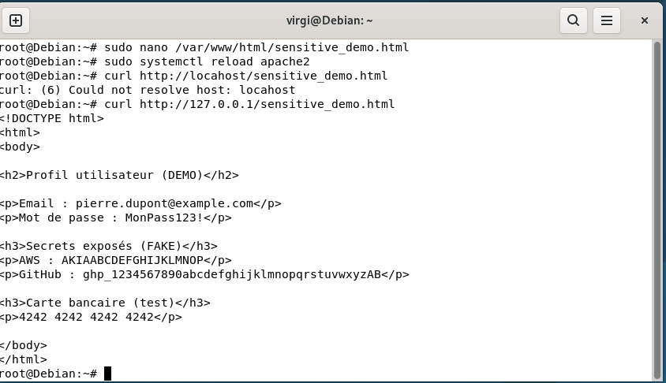
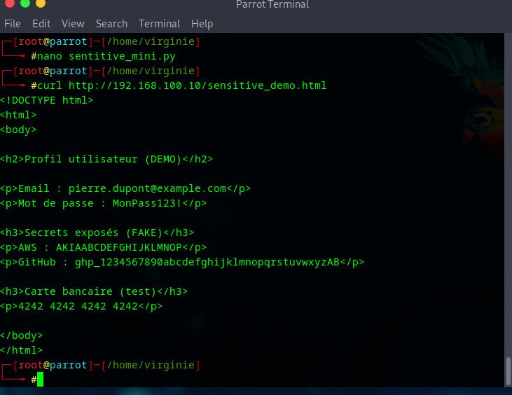
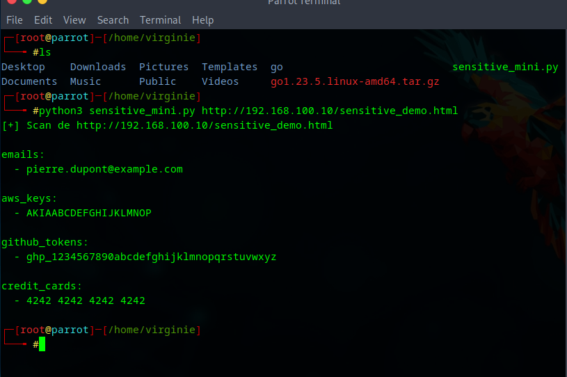

  
  

  

<h1 align="center">Sensitive Data Exposure - Environment Controlé</h1>

© 2026 Virginie Lechene - Tous droits réservés  
Reproduction interdite sans autorisation préalable.  
Usage pédagogique uniquement.

 

  

<i>Image protégée - Propriété exclusive</i>

---

# Objectif

Ce projet démontre, dans un **environnement strictement contrôlé**, comment des données sensibles peuvent être **exposées involontairement** via une page web, puis **détectées automatiquement** à l’aide d’un script Python utilisant des **expressions régulières**.

Toutes les données utilisées sont **fictives** et destinées **uniquement à la démonstration pédagogique**.

--- 

## 📑 Sommaire

1. [Présentation du projet](#présentation-du-projet)
2. [Objectif pédagogique](#objectif-pédagogique)
3. [Environnement de test](#environnement-de-test)
4. [Architecture du lab](#architecture-du-lab)
5. [Étape 1 – Préparation de l’environnement](#étape-1--préparation-de-lenvironnement)
6. [Étape 2 – Vérification du serveur web](#étape-2--vérification-du-serveur-web)
7. [Étape 3 – Création de la page HTML exposée](#étape-3--création-de-la-page-html-exposée)
8. [Étape 4 – Test local de la page](#étape-4--test-local-de-la-page)
9. [Étape 5 – Accès distant depuis Parrot OS](#étape-5--accès-distant-depuis-parrot-os)
10. [Étape 6 – Création du script de détection](#étape-6--création-du-script-de-détection)
11. [Étape 7 – Vérification du script](#étape-7--vérification-du-script)
12. [Étape 8 – Exécution du scan automatisé](#étape-8--exécution-du-scan-automatisé)
13. [Mise en situation réelle](#mise-en-situation-réelle)
14. [Analyse sécurité (contexte réel)](#analyse-sécurité-contexte-réel)
15. [Bonnes pratiques recommandées](#bonnes-pratiques-recommandées)
16. [Sécurité de l’environnement de test](#sécurité-de-lenvironnement-de-test)
17. [Avertissement](#avertissement)
18. [Résultat final](#résultat-final)

---

## 📊 Avancement global du projet

| ID | Fonction                           | Statut   |
|----|-----------------------------------|----------|
| 1  | Crawler HTML récursif              | ✅ Validé |
| 2  | Détection SQL Injection            | ✅ Validé |
| 3  | Détection XSS                      | ✅ Validé |
| 4  | Recherche de données sensibles     | ✅ Validé |
| 5  | Génération de rapports (JSON / MD) | ⏳ À venir |

# Environnement

- **Client** : Parrot OS  
- **Serveur** : Debian GNU/Linux + Apache2  
- **Réseau** : privé / isolé (`192.168.x.x`)  
- **Hyperviseur** : VirtualBox  

---

📄 Étape 1 - Vérification de la connectivité réseau

Avant toute analyse applicative, la connectivité réseau entre les machines virtuelles est vérifiée à l’aide de requêtes ICMP.  

➡ICMP est un protocole réseau utilisé pour tester la connectivité entre deux machines, notamment via la commande `ping`.   

### Parrot → Debian
ping 192.168.100.10

Debian → Parrot
ping 192.168.100.20

✅ Résultat attendu : communication réseau fonctionnelle.

  
  

---

 📄 Étape 2 - Vérification du serveur web (Debian)

Cette étape permet de confirmer que le service Apache est actif sur la machine cible.

sudo systemctl status apache2

➡ Apache est actif et prêt à servir du contenu.

  

---

📄 Étape 3 - Création de la page HTML exposée (Debian)   

Une page HTML de démonstration est créée afin de simuler une exposition de données sensibles.   

sudo nano /var/www/html/sensitive_demo.html   

La page contient volontairement les éléments suivants (données factices) :   
	•	adresse e-mail fictive   
	•	mot de passe de démonstration   
	•	clé AWS factice  
	•	token GitHub factice    
	•	numéro de carte bancaire de test      

Recharge du service Apache :    

sudo systemctl reload apache2   

  

---

📄 Étape 4 - Test local de la page (Debian)

Cette étape permet de vérifier que la page est correctement servie par Apache côté serveur.

`curl http://127.0.0.1/sensitive_demo.html`

➡ La page est bien servie localement.

---

📄 Étape 5 - Accès distant depuis Parrot OS

Un accés distant à la page exposée est réalisé depuis Parrot OS via le réseau interne.

Commande utilisée :  
`curl http://192.168.100.10/sensitive_demo.html`

➡ **Les données exposées sont accessibles depuis le réseau interne.**

---

📄 Étape 6 - Création du script de détection (Parrot)   

Un script Python minimaliste est créé afin d’analyser le contenu de la page web.   

nano sensitive_mini.py   

Fonctions du script :   
	•	téléchargement du contenu HTML    
	•	détection via expressions régulières (regex)    
	•	affichage structuré des résultats   

---

📂 Étape 7 - Vérification du script   

La présence du script dans le répertoire courant est vérifiée.   

ls   

▶️ Étape 8 - Exécution du scan automatisé   

Le script est exécuté contre l’URL de la page exposée.   

Commande utilisée :
`python3 sensitive_mini.py (http://192.168.100.10/sensitive_demo.html)`

Résultats détectés :   
	•	adresse e-mail   
	•	clé AWS (fake)   
	•	token GitHub (fake)   
	•	numéro de carte bancaire de test   

---

### Découverte automatisée de l’exposition

Dans un environnement réel, ce type de ressource exposée n’est pas
nécessairement découvert par un humain.

Des outils automatisés (robots, scanners, crawlers) parcourent en
permanence les réseaux et les serveurs afin de détecter :
- des pages accessibles publiquement,
- des fichiers oubliés,
- des contenus contenant des données sensibles.

Ces scans peuvent être réalisés :
- par des moteurs de recherche,
- par des outils de sécurité,
- ou par des acteurs malveillants.

Ainsi, une page de test oubliée peut être détectée **rapidement et
automatiquement**, sans aucune action ciblée.

---

### GitHub Actions ✅ Password Check

Ce projet inclut un workflow GitHub Actions exécutant un script Python
de vérification de mots de passe dans un contexte CI/CD.

Le script fonctionne sans interaction utilisateur et vise à démontrer
le principe d’un contrôle automatisé de bonnes pratiques de sécurité.

---

##  Mise en situation réelle

Lors du développement d’une application web, une page de test est créée et placée dans le dossier public du serveur afin de faciliter les vérifications.  
Lors du déploiement en production, cette page n’est plus utilisée mais n’est pas supprimée.

Le serveur web continuant de servir automatiquement tous les fichiers présents dans ce dossier, la page reste accessible via son URL.  
Cette situation, fréquente en environnement réel, peut entraîner une exposition involontaire de données sensibles.    

---

##  Analyse sécurité (contexte réel)

Dans un environnement réel, ce type d’exposition peut provenir :
- d’une page de test oubliée  
- d’un fichier de debug  
- d’une API trop verbeuse  
- de secrets exposés côté frontend  

⚠️ **Aucune exploitation avancée n’est nécessaire** :  
il suffit d’accéder à la ressource exposée et d’en analyser le contenu.

---

##  Bonnes pratiques recommandées

- supprimer immédiatement le contenu exposé  
- révoquer et faire tourner les secrets  
- utiliser des variables d’environnement  
- mettre en place des scans de secrets automatisés (CI/CD)  
- réaliser des audits de sécurité réguliers  

---

## 🔒 Sécurité de l’environnement de test

- réseau isolé  
- aucune exposition Internet  
- service Apache arrêté après la démonstration  
- données strictement factices  

---

## ⚠️ Avertissement

Projet strictement éducatif.  
Aucune donnée réelle n’est utilisée.  
Aucun système tiers n’a été ciblé.

---

## ✅ Résultat final

✔ Projet publiable sur GitHub  
✔ Lisible par recruteur ou jury  
✔ Orientation **défensive et pédagogique**

---

✍️ Auteur : *Virginie Lechene*

---

## Licence
Le script est publié sous la licence MIT.

## À propos de l’usage
Ce projet est destiné exclusivement à des fins pédagogiques, notamment dans le cadre de :
- d’une formation en cybersécurité,
- de tests d’intrusion légaux (pentest),
- d’analyses réseau dans un environnement contrôlé.

⚠️ L’auteure ne cautionne ni n’autorise l’utilisation de ce script en dehors d’un cadre légal strictement défini.
Toute utilisation non conforme est interdite et relève uniquement de la responsabilité de l’utilisateur.

## Droits sur les visuels
Les visuels, illustrations ou captures présents dans ce dépôt sont la propriété exclusive de l’auteure.
Toute reproduction ou utilisation non autorisée est interdite.

